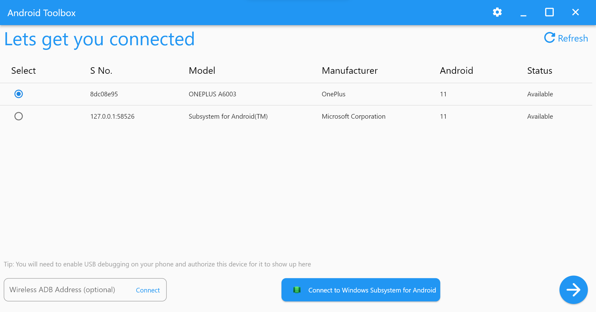
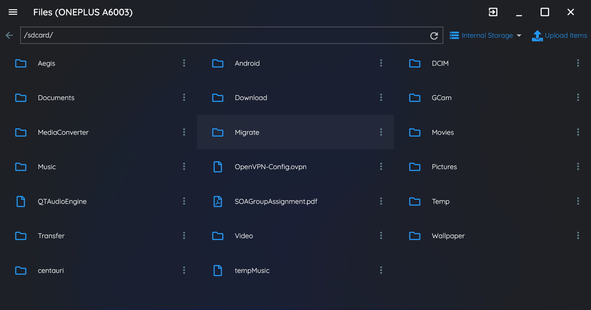
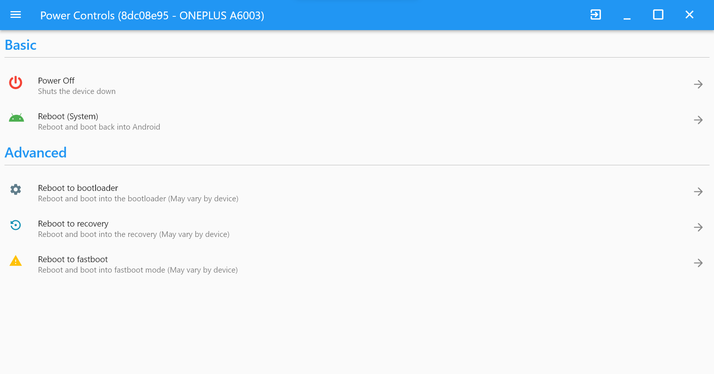
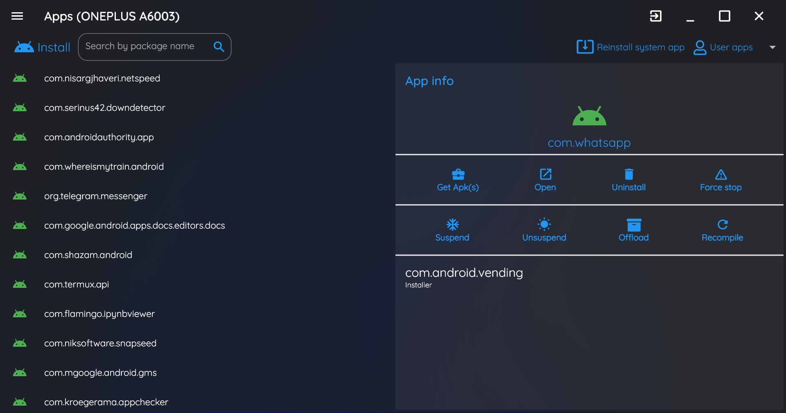
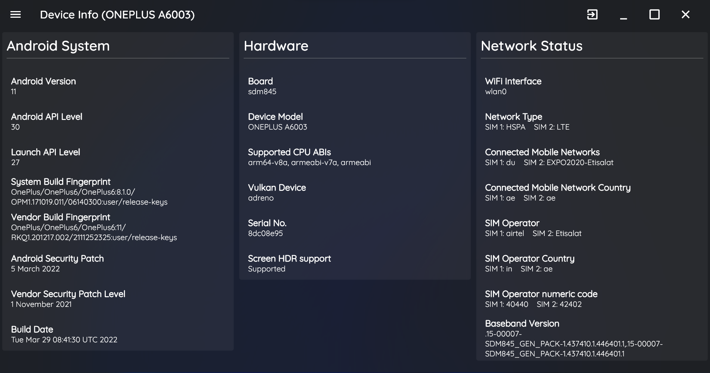

 

    
    <h1>Android-Toolbox</h1>

   

    <h3>Update</h3>
    
MacOS builds are now available starting version 2.0.0. 

    <h2>About</h2>
    
This application is built with Flutter. It uses adb behind the scenes to execute each and every user operation. The application comes bundled with adb, so you need not have adb installed and configured in path. I plan to bring it to linux after adding some functionality.

    <h2>What does it do?</h2>
        Current features:
        <ul>
            <li>
                You can now perform some file management tasks (External SD card supported)
            </li>
            <li>
                Reboot to system, recovery, fastboot, bootloader or simply power off using the power controls
            </li>
            <li>
                You can offload, suspend, un-suspend, install, uninstall, kill or recompile apps. <em>(Apps are currently shown as package names only. I couldn't find a way to get app titles without pushing aapt to the mobile device.)</em>
            </li>
            <li>
                Support for installing split apks and batch install apk <em>(Coming Soon)</em>
            </li>
            <li>
                <b>Bloatware or other system apps can now be uninstalled</b>
            </li>
            <li>
                <b>Full Windows Subsystem for Android (WSA) compatibility (WSA is retiring on March 5, 2025)</b>
            </li>
            <li>
                <em>More soon......</em>
            </li>
        </ul>
    

    <h2>Okay I'm interested. How do I install it?</h2>
    
Windows, macOS and linux installers/binaries are available. You may download it from this repo's releases which you can find here: [Releases](https://github.com/lightningbolt047/Android-Toolbox/releases). Or if you are very much interested to compile and run, you may as well clone this repo and build it for yourself.

    <h2>Do I have to keep checking this repo for future updates to the app?</h2>
    
No you don't! The app will notify you when there is an update available, and you may choose to download and install the update from within the app.

    <h2>Feature X is awesome, I can't wait to try it out, but it is a prerelease. How do I try it out?</h2>
    
There is support for updating to prerelease builds from within the app. Beware! Prerelease builds might not work as intended, and may even break updates (which might happen if I screw with the updater) in which case you will have to manually install the next update.

    <h2>Why would I use the app's file manager when I can simply use Windows Explorer?</h2>
    
Gone are the days when we could use USB storage and mount the device as a storage device in windows. Right now MTP is being used and it is painful to use especially when transferring large number of files. ADB pull/push seems to be way faster when working with large number of files (I got an almost 2x improvement using my highly unscientific method of testing speed)

    <h2>Screenshots</h2>
    <h3>Connection Initiation</h3>
    
    <h3>File Manager</h3>
    
    <h3>Power Controls</h3>
    
    <h3>Apps</h3>
    
    <h3>Device Info</h3>
    

    <h2>Clone and build it yourself</h2>
    <ul>
        <li>
            Make sure you have the Flutter SDK installed. You may check this by running <code>flutter doctor</code>.
        </li>
        <li>
            Clone this repo: <code>git clone https://github.com/lightningbolt047/Android-Toolbox.git</code>.
        </li>
        <li>
            Fetch the dependencies using <code>flutter pub get</code>
        </li>
        <li>
            Build a release build: <code>flutter build [platform_name] --release</code>
        </li>
    </ul>

